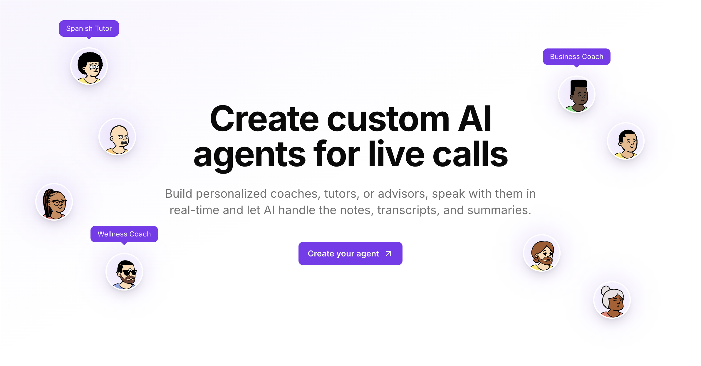

<div align="center">
  <a href="https://www.meetminds.app/">
    
  </a>
</div>

<div align="center">
    <h1>MeetMinds</h1>
    <p>
        Create personal AI coaches or tutors for on-demand live calls.
    </p>
</div>

## Why I Built This

Earlier this year (2025), I was fortunate to be selected for Mastercard Foundation's FAST program, a six-month cohort-based program for founders. The program included non-dilutive funding, business coaching, and coursework on business fundamentals. I had monthly calls with a business coach to discuss goals, tackle challenges, and get guidance. Those sessions were incredibly valuable.

When the program ended, I wanted to keep that momentum going. I started using ChatGPT's advanced voice mode for coaching conversations, but something was missing. I couldn't record those sessions, organize them by topic, or generate notes to reference later. I wanted to recreate that feeling of being on a real coaching call, but with the flexibility and permanence of recorded sessions.

That's how MeetMinds came to life. A place where you can create custom AI agents tailored to your needs, have video calls with them, and keep a complete record of every conversation with transcripts, summaries, and AI-powered search. Whether it's business coaching, language learning, or life advice, you now have a way to organize these conversations and come back to them whenever you need.

## Features

- **Custom AI Agents**: Create personalized agents with unique instructions and avatars
- **Real-Time Calls**: Have live conversations with your AI agents using Stream Call & Video SDK
- **Meeting Management**: Track all your sessions with statuses (upcoming, active, completed, processing)
- **Automatic Recordings**: Every call is recorded for future reference
- **AI-Generated Transcripts**: Get accurate transcriptions of your conversations
- **Smart Summaries**: AI-powered summaries highlight key insights and action items
- **Meeting Q&A**: Ask questions about your past conversations using AI chat
- **Transcript Search**: Find specific moments across all your meetings
- **Video Playback**: Review your recordings anytime
- **Subscription Plans**: Flexible pricing tiers powered by Polar
- **Secure Authentication**: Seamless login experience with Better Auth
- **Mobile Responsive**: Works beautifully on all devices

## How it works

1. Sign up or log in to your account
2. Create a custom AI agent with specific instructions (e.g., "Business Coach", "Spanish Tutor", "Life Advisor")
3. Start a meeting with your agent
4. Have a real-time video conversation
5. After the call, view your transcript, summary, and recording
6. Use the AI chat to ask questions about your meetings
7. Search through transcripts to find specific topics or moments

## Getting Started

You have two options for using MeetMinds:

### Use the Hosted Version

If you just want to start creating AI agents and having live calls right away, you can use the hosted version at [www.meetminds.app](https://www.meetminds.app).

The subscription plans are designed to cover the operational costs of running the service (API costs, hosting, storage, etc.). You'll be up and running in minutes without worrying about API keys or infrastructure.

### Self-Host

If you prefer to host it yourself, the entire codebase is open source and available here. You'll have full control over your data and infrastructure. Just follow the installation instructions below to get started.

## Prerequisites

Before running this application, make sure you have:

- Node.js 18.0 or later
- [bun](https://bun.com) or [pnpm](https://pnpm.io) package manager
- API keys for:
  - [OpenAI](https://platform.openai.com) - For AI conversations and summarization
  - [Stream](https://getstream.io) - For video and chat functionality
  - [Polar](https://polar.sh) - For subscription management
- A [Neon](https://neon.tech) PostgreSQL database

## Environment Setup

1. Clone the repository
2. Copy the `.env.example` file to `.env`:
   ```bash
   cp .env.example .env
   ```
3. Fill in all the required environment variables in your `.env` file. Each variable includes a comment describing its purpose. See `.env.example` for the complete list of required variables.

### Ngrok Webhook Setup (Optional for Local Development)

The `dev:webhook` script uses [ngrok](https://ngrok.com) to expose your local development server to the internet, allowing Stream Video to send webhook events to your local environment.

**Why is this needed?**

Stream Video sends webhook events (like call recordings, transcripts, and session updates) to your application. In development, your local server isn't accessible from the internet, so ngrok creates a secure tunnel to forward webhooks to `localhost:3000`.

**Setup Instructions:**

1. **Create an ngrok account** (free tier available):

   - Sign up at [ngrok.com](https://ngrok.com)
   - Get your authtoken from the dashboard

2. **Configure ngrok** (if not already done):

   ```bash
   ngrok config add-authtoken YOUR_AUTHTOKEN
   ```

3. **Set up a static domain** (recommended):

   - In the ngrok dashboard, create a static domain (e.g., `slug-inspired-moray.ngrok-free.app`)
   - This ensures your webhook URL stays consistent across restarts

4. **Configure the environment variable**:

   - Add your ngrok domain to `.env` or `.env.local`:
     ```bash
     NGROK_DOMAIN="your-static-domain.ngrok-free.app"
     ```
   - Only include the domain part, not the full URL (no `https://`)

5. **Configure Stream webhook URL**:
   - In your [Stream Dashboard](https://dashboard.getstream.io/), go to your app settings
   - Set the webhook URL to: `https://your-static-domain.ngrok-free.app/api/webhooks/stream`
   - Make sure webhook signing is enabled (required for security)

**Important Notes:**

- The ngrok tunnel is only needed for **local development**
- In production, your application is already publicly accessible, so ngrok is not required
- Keep your ngrok domain private and don't commit it to version control
- The webhook endpoint at `/api/webhooks/stream` handles Stream Video events like:
  - Call session started/ended
  - Recording ready
  - Transcription ready
  - Participant events

## Installation

```bash
# Install dependencies
bun install
# or
pnpm install

# Push database schema
bun run db:push
# or
pnpm run db:push

# Run the development server
bun dev
# or
pnpm run dev
```

Open [http://localhost:3000](http://localhost:3000) with your browser to see the application.

## Development

```bash
# Run Inngest dev server (for background jobs)
bun run dev:inngest
# or
pnpm run dev:inngest


# Run the webhook server (for Stream calls)
# Note: Requires ngrok setup (see Environment Setup section)
bun run dev:webhook
# or
pnpm run dev:webhook

# Open Drizzle Studio (database management)
 bun run db:studio
# or
pnpm run db:studio
```

## Production

To build and run the application in production:

```bash
# Build the application for production
bun run build
# or
pnpm run build

# Start the production server
bun start
# or
pnpm start
```

### Production Considerations

- **Environment Variables**: Ensure all production environment variables are set in your hosting platform (Vercel, Railway, etc.) or in your production `.env` file
- **Database**: Make sure your production database is properly configured and migrations are applied
- **Polar Server**: Update `POLAR_SERVER` to `"production"` in your production environment
- **Better Auth URL**: Set `BETTER_AUTH_URL` to your production domain (e.g., `https://yourdomain.com`)
- **Next.js Public URL**: Set `NEXT_PUBLIC_APP_URL` to your production domain
- **Inngest**: Configure Inngest for production with proper event keys and signing keys
- **Stream**: Ensure Stream Video and Chat are configured with production API keys

The production build optimizes your application for performance, including:

- Code minification and tree-shaking
- Image optimization
- Static page generation where applicable
- Server-side rendering optimization

## Security Notes

- Never commit your `.env` file to version control
- Keep your API keys secure and rotate them regularly
- Use environment variables for all sensitive information

## Tech Stack

- [Next.js 15](https://nextjs.org/) - React Framework with App Router
- [React 19](https://react.dev/) - UI Library
- [TypeScript](https://www.typescriptlang.org/) - Type Safety
- [Tailwind CSS v4](https://tailwindcss.com/) - Styling
- [Shadcn/ui](https://ui.shadcn.com/) - UI Components
- [Stream Video SDK](https://getstream.io/video/) - Real-time video calls
- [Stream Chat SDK](https://getstream.io/chat/) - Messaging functionality
- [OpenAI](https://openai.com/) - AI conversations and summarization
- [Better Auth](https://www.better-auth.com/) - Authentication
- [Polar](https://polar.sh) - Subscription management
- [Inngest](https://www.inngest.com/) - Background job processing
- [tRPC](https://trpc.io/) - Type-safe API layer
- [Drizzle ORM](https://orm.drizzle.team/) - Database ORM
- [Neon](https://neon.tech) - PostgreSQL database

## Contributing

Contributions are welcome! Please feel free to submit a Pull Request.

## License

This project is licensed under the MIT License. See the LICENSE file for details.
